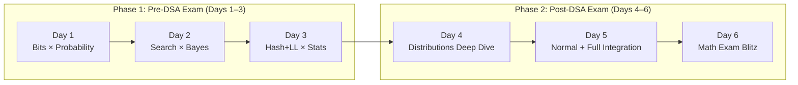

# 🌉 Bridge to Mastery — Intensive Study Plan

> **DSA Exam:** March 6, 2026 (5:30–7:30 PM, 120 min)
> **Math Exam:** March 9, 2026 (5:30–7:00 PM, 90 min)
> **Today:** March 3, 2026 — **3 days to DSA, 6 days to Math**

> [!CAUTION]
> This is a **sprint plan**. Days 1–3 are dual-focus (DSA + Math). Days 4–6 shift to Math-only deep dives after the DSA exam is done.

---

## 🗺️ Thematic Pairing Map



---

## 📅 Phase 1 — Weekly Schedule (Days 1–3: Dual Focus)

| Day | Date | DSA Focus (Sessions) | Math Focus (Sessions) | Theme |
|-----|------|---------------------|-----------------------|-------|
| **1** | Mar 3 (Tue) | Bit Manipulation (DSA Sessions 1–3) | Probability Foundations (Math Sessions 1–2) | *Binary Outcomes: Bits are Bernoulli Trials* |
| **2** | Mar 4 (Wed) | Binary Search (DSA Sessions 4–6) | Bayes' Theorem & Problem Solving (Math Sessions 3–4) | *Narrowing the Search Space = Updating Priors* |
| **3** | Mar 5 (Thu) | Hashing + Linked Lists (DSA Sessions 7–11) | Statistics & Measures (Math Session 5) | *Hash Distributions ≈ Data Distributions* |

## 📅 Phase 2 — Weekly Schedule (Days 4–6: Math Deep Dive)

| Day | Date | Math Focus (Sessions) | Theme |
|-----|------|----------------------|-------|
| **4** | Mar 7 (Sat) | Probability Distributions (Math Session 6, merged 7) | *From Discrete Trials to Distribution Shapes* |
| **5** | Mar 8 (Sun) | Normal Distribution (Math Session 8) + Full Review | *The Bell Curve: Where Everything Converges* |
| **6** | Mar 9 (Mon AM) | **Exam Blitz** — Rapid-fire review | *Speed Drills & Edge Cases* |

---

## 📘 Day 1 — Bits × Probability (Mar 3)

### 🔗 The Why
> *Every bit is a Bernoulli trial — it's either 0 or 1. Understanding bitwise operations trains the same mental model as computing sample spaces for binary outcomes: $2^n$ possibilities for $n$ bits mirror $2^n$ outcomes in $n$ coin flips.*

### 📖 Sessions Covered

| DSA Sessions | Math Sessions |
|---|---|
| **Session 1:** Bitwise AND, OR, XOR, negatives, shifts | **Session 1:** Probability vocab, sample spaces, events |
| **Session 2:** Check/Set/Flip/Unset bit, Max AND pair | **Session 2:** Conditional & joint probability, Venn diagrams |
| **Session 3:** Count set bits, Single Number variants | |

---

### ☕ Java 8 Drill — Bit Manipulation Gauntlet

#### Drill 1: Bit Toolkit (Warm-up, 30 min)
```java
// Implement a BitToolkit class using Java 8 features
public class BitToolkit {
    // 1. Check if k-th bit is set using a lambda
    public static final BiFunction<Integer, Integer, Boolean> isKthBitSet =
        (n, k) -> (n & (1 << k)) != 0;

    // 2. Count set bits using Integer.bitCount or manual loop
    public static int countSetBits(int n) { /* implement */ }

    // 3. Flip the k-th bit
    public static int flipBit(int n, int k) { /* implement */ }

    // 4. Find the single number in array where every other appears twice
    //    USE: Arrays.stream(arr).reduce(0, (a, b) -> a ^ b);
    public static int singleNumber(int[] arr) { /* implement with streams */ }
}
```

#### Drill 2: Advanced — Single Number II (45 min)
```java
// Every element appears 3 times except one. Find the unique element.
// Approach: Count bits at each position mod 3
public static int singleNumberII(int[] arr) {
    // Hint: Use IntStream.range(0, 32) to iterate bit positions
    // For each position, sum all bits at that position
    // If sum % 3 != 0, that bit belongs to the unique number
}
```

#### Drill 3: Max AND Pair (30 min)
```java
// Find max A[i] & A[j] where i != j
// Strategy: Greedy from MSB. Try to keep numbers that have each bit set.
public static int maxAndPair(int[] arr) { /* implement */ }
```

---

### 🐍 Python Math Lab — Probability Foundations

#### Lab 1: Sample Space Explorer (30 min)
```python
import numpy as np
from itertools import product

# 1. Generate the sample space for 4 coin flips
sample_space = list(product([0, 1], repeat=4))
print(f"Total outcomes (should be 2^4 = 16): {len(sample_space)}")

# 2. Event A: "Exactly 2 heads" — compute P(A)
event_a = [s for s in sample_space if sum(s) == 2]
p_a = len(event_a) / len(sample_space)
print(f"P(exactly 2 heads) = {p_a}")  # Should be 6/16 = 0.375

# 3. Event B: "First flip is heads" — compute P(B)
event_b = [s for s in sample_space if s[0] == 1]
p_b = len(event_b) / len(sample_space)

# 4. Compute P(A ∩ B) and verify P(A|B) = P(A ∩ B) / P(B)
event_a_and_b = [s for s in sample_space if sum(s) == 2 and s[0] == 1]
p_a_given_b = len(event_a_and_b) / len(event_b)
print(f"P(A|B) = {p_a_given_b}")
```

#### Lab 2: Empirical vs. Theoretical (20 min)
```python
# Simulate 100,000 experiments of 4 coin flips
simulations = np.random.randint(0, 2, size=(100_000, 4))
empirical_p = np.mean(simulations.sum(axis=1) == 2)
print(f"Empirical P(exactly 2 heads) = {empirical_p:.4f}")
print(f"Theoretical = 0.375 | Error = {abs(empirical_p - 0.375):.4f}")
```

---

### ✅ Day 1 Skill Check — Combined Challenge

> **The Bit-Probability Bridge Problem:**
>
> You have an array of $N = 8$ random integers, each in the range $[0, 15]$ (i.e., 4-bit numbers).
>
> 1. **Java Part:** Write a Java 8 Stream pipeline to find the XOR of all elements. What's the probability that the result is 0? *(Hint: Think about each bit independently.)*
>
> 2. **Math Part:** Model each bit position as an independent Bernoulli trial with $p = 0.5$. For the XOR of $N$ values at a single bit position to be 0, an **even** number of 1s must appear. Using the Binomial coefficient:
>    $$P(\text{even 1s in } N \text{ trials}) = \frac{1}{2}\left(1 + (1-2p)^N\right) = \frac{1}{2}$$
>    Since there are 4 independent bit positions: $P(\text{XOR} = 0) = (1/2)^4 = 1/16$
>
> 3. **Verify with Python:**
> ```python
> import numpy as np
> trials = 100_000
> results = [np.bitwise_xor.reduce(np.random.randint(0, 16, 8)) for _ in range(trials)]
> print(f"P(XOR=0) ≈ {np.mean(np.array(results) == 0):.4f}")  # Should ≈ 0.0625
> ```

---

## 📘 Day 2 — Search × Bayes (Mar 4)

### 🔗 The Why
> *Binary search works by eliminating half the search space at each step — exactly like Bayesian updating, where new evidence eliminates hypotheses. Both use **logarithmic convergence**: binary search runs in $O(\log n)$, and Bayesian posteriors converge in $O(\log(1/\epsilon))$ updates.*

### 📖 Sessions Covered

| DSA Sessions | Math Sessions |
|---|---|
| **Session 4:** Search sorted array, first/last occurrence, peak element | **Session 3:** Bayes' Theorem, prior → posterior, tree diagrams |
| **Session 5:** Rotated sorted array, Painter's Partition, √n | **Session 4:** Problem solving with Prob + Bayes |
| **Session 6:** Painter's Partition (time), Aggressive Cows | |

---

### ☕ Java 8 Drill — Binary Search Mastery

#### Drill 1: First & Last Occurrence Template (30 min)
```java
// Template: Parametric binary search using a Predicate<Integer>
import java.util.function.Predicate;

public class BinarySearchToolkit {
    // Generic binary search that finds the first index satisfying a predicate
    public static int firstTrue(int lo, int hi, Predicate<Integer> predicate) {
        while (lo < hi) {
            int mid = lo + (hi - lo) / 2;
            if (predicate.test(mid)) hi = mid;
            else lo = mid + 1;
        }
        return lo;
    }

    // Find first occurrence of K
    public static int firstOccurrence(int[] arr, int k) {
        return firstTrue(0, arr.length, mid -> mid < arr.length && arr[mid] >= k);
    }

    // Find last occurrence of K
    public static int lastOccurrence(int[] arr, int k) {
        int pos = firstTrue(0, arr.length, mid -> mid < arr.length && arr[mid] > k);
        return (pos > 0 && arr[pos - 1] == k) ? pos - 1 : -1;
    }
}
```

#### Drill 2: Search in Rotated Sorted Array (30 min)
```java
public static int searchRotated(int[] arr, int target) {
    int lo = 0, hi = arr.length - 1;
    while (lo <= hi) {
        int mid = lo + (hi - lo) / 2;
        if (arr[mid] == target) return mid;
        // Determine which half is sorted
        if (arr[lo] <= arr[mid]) {  // Left half is sorted
            if (target >= arr[lo] && target < arr[mid]) hi = mid - 1;
            else lo = mid + 1;
        } else {  // Right half is sorted
            if (target > arr[mid] && target <= arr[hi]) lo = mid + 1;
            else hi = mid - 1;
        }
    }
    return -1;
}
```

#### Drill 3: Aggressive Cows — Binary Search on Answer (45 min)
```java
// Place C cows in N stalls to maximize the minimum distance
// Binary search on the answer: the minimum distance D
public static int aggressiveCows(int[] stalls, int cows) {
    Arrays.sort(stalls);
    int lo = 1, hi = stalls[stalls.length - 1] - stalls[0];
    int ans = 0;
    while (lo <= hi) {
        int mid = lo + (hi - lo) / 2;  // Try this as min distance
        if (canPlace(stalls, cows, mid)) {
            ans = mid;
            lo = mid + 1;  // Try larger distance
        } else {
            hi = mid - 1;
        }
    }
    return ans;
}

private static boolean canPlace(int[] stalls, int cows, int minDist) {
    int count = 1, lastPos = stalls[0];
    for (int i = 1; i < stalls.length; i++) {
        if (stalls[i] - lastPos >= minDist) {
            count++;
            lastPos = stalls[i];
        }
    }
    return count >= cows;
}
```

---

### 🐍 Python Math Lab — Bayes' Theorem

#### Lab 1: The Classic Medical Test Problem (30 min)
```python
# Disease prevalence: 1%
# Test sensitivity (P(+|disease)): 99%
# Test specificity (P(-|no disease)): 95%

p_disease = 0.01
p_no_disease = 1 - p_disease
p_pos_given_disease = 0.99    # Sensitivity
p_pos_given_no_disease = 0.05 # 1 - Specificity

# Bayes' Theorem: P(disease|+) = P(+|disease) * P(disease) / P(+)
p_pos = p_pos_given_disease * p_disease + p_pos_given_no_disease * p_no_disease
p_disease_given_pos = (p_pos_given_disease * p_disease) / p_pos

print(f"P(Disease | Positive Test) = {p_disease_given_pos:.4f}")
# Answer: ≈ 0.1667 — Only 16.7%! The prior matters enormously.
```

#### Lab 2: Bayesian Updating — Simulate "Binary Search" on Priors (30 min)
```python
import numpy as np

# Analogy: We have 100 hypotheses (like 100 array positions)
# Each "test" (evidence) eliminates roughly half
n_hypotheses = 100
prior = np.ones(n_hypotheses) / n_hypotheses  # Uniform prior

true_hypothesis = 42  # The "target"

for step in range(7):  # ~log2(100) ≈ 7 steps to converge
    # Evidence: is the true hypothesis in the upper or lower half of remaining?
    midpoint = np.median(np.where(prior > 0.001)[0])
    likelihood = np.where(
        np.arange(n_hypotheses) <= midpoint,
        1.0 if true_hypothesis <= midpoint else 0.01,
        0.01 if true_hypothesis <= midpoint else 1.0
    )
    posterior = prior * likelihood
    posterior /= posterior.sum()  # Normalize
    prior = posterior
    print(f"Step {step+1}: Max posterior at index {np.argmax(posterior)}, "
          f"confidence = {np.max(posterior):.4f}")
```

---

### ✅ Day 2 Skill Check — Combined Challenge

> **The Search-Bayes Bridge Problem:**
>
> You're debugging a sorted array of 1,000 elements with **exactly one corrupted value** (one element is out of place).
>
> 1. **Java Part:** Implement modified binary search that finds the corrupted index. At each step, check if `arr[mid-1] <= arr[mid] <= arr[mid+1]`. If violated, return `mid`.
>
> 2. **Math Part:** Model this as a Bayesian search problem:
>    - **Prior:** $P(\text{corrupted at index } i) = 1/1000$ (uniform)
>    - Each binary search step splits the search space. After $k$ steps, the posterior concentrates on $1000/2^k$ candidates.
>    - **Question:** How many steps until $P(\text{correct index}) > 0.99$?
>    - **Answer:** $1000/2^k = 1 \Rightarrow k = \lceil \log_2 1000 \rceil = 10$ steps.
>
> 3. **Python verification:**
> ```python
> import math
> k = math.ceil(math.log2(1000))
> print(f"Steps needed: {k}")  # 10
> print(f"P(found) after {k} steps = {1 / (1000 / 2**k):.2f}")  # 1.02 ≈ certain
> ```

---

## 📘 Day 3 — Hashing + Linked Lists × Statistics (Mar 5)

### 🔗 The Why
> *A good hash function distributes keys **uniformly** — the same property we want from a uniform probability distribution. Collision analysis is fundamentally a statistics problem: "Given $N$ keys in $M$ buckets, what's the expected collision count?" Meanwhile, linked list traversal is like computing a **running mean** — you accumulate values node by node.*

### 📖 Sessions Covered

| DSA Sessions | Math Sessions |
|---|---|
| **Session 7:** HashMap/HashSet intro, frequency, distinct elements | **Session 5:** Descriptive vs. inferential stats, central tendency, spread |
| **Session 8:** Pair sum, subarray sum = 0/K | |
| **Session 9:** Hash function, chaining, longest substring/sequence | |
| **Session 10:** Linked List intro, access, insert, delete | |
| **Session 11:** Reverse LL, shallow vs. deep copy, middle element | |

---

### ☕ Java 8 Drill — Hashing + Linked Lists Combined

#### Drill 1: Custom HashMap with Chaining (45 min)
```java
// Implement a simplified HashMap using chaining (LinkedList per bucket)
// Must use Java 8 features: generics, Optional for lookups
public class MyHashMap<K, V> {
    private LinkedList<Entry<K, V>>[] buckets;
    private int size;
    private static final int INITIAL_CAPACITY = 16;

    static class Entry<K, V> {
        K key; V value;
        Entry(K key, V value) { this.key = key; this.value = value; }
    }

    @SuppressWarnings("unchecked")
    public MyHashMap() {
        buckets = new LinkedList[INITIAL_CAPACITY];
        Arrays.setAll(buckets, i -> new LinkedList<>());
    }

    private int hash(K key) {
        return Math.abs(key.hashCode() % buckets.length);
    }

    public Optional<V> get(K key) {
        return buckets[hash(key)].stream()
            .filter(e -> e.key.equals(key))
            .map(e -> e.value)
            .findFirst();
    }

    public void put(K key, V value) { /* implement: check existing, add/update */ }
    public int chainLengthAt(int bucket) { return buckets[bucket].size(); }
}
```

#### Drill 2: Longest Consecutive Sequence with HashSet (30 min)
```java
public static int longestConsecutive(int[] arr) {
    Set<Integer> set = Arrays.stream(arr).boxed().collect(Collectors.toSet());
    return set.stream()
        .filter(n -> !set.contains(n - 1))  // Only start from sequence beginnings
        .mapToInt(n -> {
            int len = 0;
            while (set.contains(n + len)) len++;
            return len;
        })
        .max().orElse(0);
}
```

#### Drill 3: Linked List — Reverse + Find Middle (30 min)
```java
public class LinkedListOps<T> {
    static class Node<T> { T data; Node<T> next; }

    // Iterative reversal
    public Node<T> reverse(Node<T> head) { /* implement with 3 pointers */ }

    // Find middle using slow/fast pointer
    public Optional<T> findMiddle(Node<T> head) {
        if (head == null) return Optional.empty();
        Node<T> slow = head, fast = head;
        while (fast != null && fast.next != null) {
            slow = slow.next;
            fast = fast.next.next;
        }
        return Optional.of(slow.data);
    }

    // Deep copy
    public Node<T> deepCopy(Node<T> head) { /* implement */ }
}
```

---

### 🐍 Python Math Lab — Statistics Fundamentals

#### Lab 1: Central Tendency & Spread (30 min)
```python
import numpy as np
from scipy import stats

# Dataset: Simulated hash chain lengths for 1000 keys in 128 buckets
np.random.seed(42)
chain_lengths = np.random.poisson(lam=1000/128, size=128)  # Expected ≈ 7.8

print(f"Mean chain length: {np.mean(chain_lengths):.2f}")
print(f"Median chain length: {np.median(chain_lengths):.2f}")
print(f"Mode chain length: {stats.mode(chain_lengths, keepdims=True).mode[0]}")
print(f"Std Dev: {np.std(chain_lengths):.2f}")
print(f"25th percentile: {np.percentile(chain_lengths, 25):.2f}")
print(f"75th percentile: {np.percentile(chain_lengths, 75):.2f}")
print(f"IQR: {np.percentile(chain_lengths, 75) - np.percentile(chain_lengths, 25):.2f}")
```

#### Lab 2: Percentile Drill (20 min)
```python
# Exam scores of 50 students
scores = np.random.normal(loc=72, scale=12, size=50).astype(int)
scores = np.clip(scores, 0, 100)

for p in [10, 25, 50, 75, 90]:
    print(f"{p}th percentile: {np.percentile(scores, p):.1f}")

# If your score is 85, what percentile are you?
my_score = 85
my_percentile = stats.percentileofscore(scores, my_score)
print(f"Score of {my_score} is at the {my_percentile:.1f}th percentile")
```

---

### ✅ Day 3 Skill Check — Combined Challenge

> **The Hash-Statistics Bridge Problem:**
>
> You insert $N = 500$ random keys into a hash map with $M = 64$ buckets.
>
> 1. **Java Part:** Implement `MyHashMap`, insert 500 random integers, then use Java 8 Streams to compute the mean and max chain length across all buckets.
>
> 2. **Math Part:** By the Birthday Problem generalization:
>    - Expected number of collisions: $N - M + M \cdot (1 - 1/M)^N$
>    - Expected chain length: $N/M = 500/64 \approx 7.81$
>    - **Question:** What's the probability that *at least one bucket* has ≥ 15 keys? (Use Poisson approximation with $\lambda = 7.81$.)
>
> 3. **Python verification:**
> ```python
> from scipy.stats import poisson
> lam = 500 / 64
> p_bucket_ge_15 = 1 - poisson.cdf(14, lam)
> p_at_least_one = 1 - (1 - p_bucket_ge_15) ** 64
> print(f"P(at least one bucket ≥ 15) = {p_at_least_one:.4f}")
> ```

---

## 🎯 **DSA EXAM — March 6, 2026 (5:30–7:30 PM)**

> [!IMPORTANT]
> **Exam Format Reminder:** 3 Multiple Correct MCQs + 2 Fill-Ups + 3 Coding Questions + 2 Coding from Assignments. Budget: ~10 min MCQ+Fill → ~20 min each coding question.

---

## 📘 Day 4 — Probability Distributions Deep Dive (Mar 7)

### 🔗 The Why
> *Now that the DSA exam is done, we zoom in on how outcomes are **distributed**. Uniform distributions are the "perfect hash function" of probability — equal chance everywhere. Bernoulli trials generalize to Binomial distributions, which model repeated binary experiments.*

### 📖 Sessions Covered

| Math Sessions |
|---|
| **Session 6:** Uniform distributions, unequal distributions, Bernoulli trials, PMF, CDF |
| **Session 7:** *(Cancelled — Binomial merged into Session 6)* |

---

### 🐍 Python Math Lab — Distributions

#### Lab 1: Uniform Distribution (20 min)
```python
from scipy.stats import uniform, bernoulli, binom
import numpy as np
import matplotlib
matplotlib.use('Agg')  # For non-GUI backend
import matplotlib.pyplot as plt

# Discrete uniform: rolling a fair die
outcomes = np.arange(1, 7)
probs = np.ones(6) / 6  # Each outcome has P = 1/6

# PMF visualization
print("Die Roll PMF:")
for o, p in zip(outcomes, probs):
    print(f"  P(X={o}) = {p:.4f}")

# CDF
for x in outcomes:
    print(f"  P(X ≤ {x}) = {x/6:.4f}")
```

#### Lab 2: Bernoulli & Binomial Distribution (40 min)
```python
# Bernoulli: Single trial, P(success) = 0.7
rv_bern = bernoulli(p=0.7)
print(f"Bernoulli PMF: P(X=0)={rv_bern.pmf(0):.2f}, P(X=1)={rv_bern.pmf(1):.2f}")
print(f"Mean={rv_bern.mean():.2f}, Var={rv_bern.var():.2f}")

# Binomial: n=20 trials, p=0.7
rv_binom = binom(n=20, p=0.7)
print(f"\nBinomial(n=20, p=0.7):")
print(f"  P(X=14) = {rv_binom.pmf(14):.4f}")
print(f"  P(X ≤ 14) = {rv_binom.cdf(14):.4f}")
print(f"  P(X > 14) = {1 - rv_binom.cdf(14):.4f}")
print(f"  Mean = {rv_binom.mean():.2f}, Std = {rv_binom.std():.2f}")

# Exam-style: At least 15 successes out of 20 with p=0.7
p_at_least_15 = 1 - rv_binom.cdf(14)
print(f"\n  P(X ≥ 15) = {p_at_least_15:.4f}")
```

#### Lab 3: PMF and CDF Visualization (20 min)
```python
x = np.arange(0, 21)
pmf_vals = rv_binom.pmf(x)
cdf_vals = rv_binom.cdf(x)

# Print table format
print(f"{'k':>3} | {'PMF':>8} | {'CDF':>8}")
print("-" * 25)
for k, p, c in zip(x, pmf_vals, cdf_vals):
    bar = "█" * int(p * 100)
    print(f"{k:>3} | {p:>8.4f} | {c:>8.4f} | {bar}")
```

---

### ✅ Day 4 Skill Check

> **Distribution Fluency Check:**
>
> A website has a 3% chance of crashing on any given request (Bernoulli trial). In a batch of 100 requests:
>
> 1. What distribution models the number of crashes? → **Binomial(n=100, p=0.03)**
> 2. What's $P(\text{exactly 5 crashes})$?
> 3. What's $P(\text{more than 3 crashes})$?
> 4. What's the expected number and std dev?
>
> ```python
> from scipy.stats import binom
> rv = binom(n=100, p=0.03)
> print(f"P(X=5) = {rv.pmf(5):.4f}")
> print(f"P(X>3) = {1 - rv.cdf(3):.4f}")
> print(f"E[X] = {rv.mean():.2f}, SD = {rv.std():.2f}")
> ```

---

## 📘 Day 5 — Normal Distribution + Full Integration (Mar 8)

### 🔗 The Why
> *The Normal distribution is the "steady state" of probability — the Central Limit Theorem guarantees that the sum of many independent variables converges to it. This is why hash chain lengths (Day 3) looked bell-shaped, and why exam scores follow Gaussian curves.*

### 📖 Sessions Covered

| Math Sessions |
|---|
| **Session 8:** Normal/Gaussian distribution, 68/95/99.7 rule, CDF, PPF |

---

### 🐍 Python Math Lab — Normal Distribution

#### Lab 1: The 68-95-99.7 Rule (20 min)
```python
from scipy.stats import norm

# Standard Normal: μ=0, σ=1
rv = norm(loc=0, scale=1)

print("68-95-99.7 Rule Verification:")
for k in [1, 2, 3]:
    prob = rv.cdf(k) - rv.cdf(-k)
    print(f"  P(-{k}σ < X < +{k}σ) = {prob:.4f} ({prob*100:.1f}%)")

# CDF: P(X ≤ 1.5)
print(f"\nP(X ≤ 1.5) = {rv.cdf(1.5):.4f}")

# PPF (inverse CDF): What value has 90% below it?
print(f"90th percentile (PPF) = {rv.ppf(0.90):.4f}")

# P(X > 2)
print(f"P(X > 2) = {1 - rv.cdf(2):.4f}")
```

#### Lab 2: Real-World Normal (30 min)
```python
# IQ scores: μ=100, σ=15
iq = norm(loc=100, scale=15)

print("IQ Distribution Analysis:")
print(f"  P(IQ > 130) = {1 - iq.cdf(130):.4f}")         # "Gifted"
print(f"  P(85 < IQ < 115) = {iq.cdf(115) - iq.cdf(85):.4f}")  # "Average"
print(f"  Top 5% threshold = {iq.ppf(0.95):.1f}")
print(f"  Bottom 10% threshold = {iq.ppf(0.10):.1f}")

# Exam style: P(score between 90 and 120)?
print(f"  P(90 < IQ < 120) = {iq.cdf(120) - iq.cdf(90):.4f}")
```

#### Lab 3: CDF + PPF Drills — Exam Prep (30 min)
```python
# Exam-style problems
# Q1: Assembly line produces bolts with diameter μ=10mm, σ=0.2mm
#     What fraction is rejected (diameter > 10.5mm or < 9.5mm)?
bolts = norm(loc=10, scale=0.2)
rejected = 1 - (bolts.cdf(10.5) - bolts.cdf(9.5))
print(f"Q1: Rejection rate = {rejected:.4f} ({rejected*100:.2f}%)")

# Q2: What diameter range covers the middle 90% of bolts?
lower = bolts.ppf(0.05)
upper = bolts.ppf(0.95)
print(f"Q2: Middle 90% range = [{lower:.3f}, {upper:.3f}] mm")

# Q3: If I sample 36 bolts, what's the probability the sample mean
#     is within 0.05mm of the true mean? (Use CLT: SE = σ/√n)
se = 0.2 / np.sqrt(36)
sample_mean_dist = norm(loc=10, scale=se)
p_within = sample_mean_dist.cdf(10.05) - sample_mean_dist.cdf(9.95)
print(f"Q3: P(sample mean within 0.05mm) = {p_within:.4f}")
```

---

### ✅ Day 5 Skill Check

> **Normal Distribution Mastery Check:**
>
> Student exam scores follow $N(\mu=68, \sigma=10)$.
>
> 1. What percentage score above 80? → `1 - norm.cdf(80, 68, 10)`
> 2. What score is the cutoff for the top 15%? → `norm.ppf(0.85, 68, 10)`
> 3. What's $P(55 < X < 75)$? → `norm.cdf(75, 68, 10) - norm.cdf(55, 68, 10)`
> 4. If 200 students take the exam, how many are expected to score between 60 and 76?
>
> ```python
> from scipy.stats import norm
> # Attempt BEFORE running!
> p1 = 1 - norm.cdf(80, 68, 10)
> p2 = norm.ppf(0.85, 68, 10)
> p3 = norm.cdf(75, 68, 10) - norm.cdf(55, 68, 10)
> p4 = (norm.cdf(76, 68, 10) - norm.cdf(60, 68, 10)) * 200
> print(f"1. P(X > 80) = {p1:.4f}")
> print(f"2. Top 15% cutoff = {p2:.2f}")
> print(f"3. P(55 < X < 75) = {p3:.4f}")
> print(f"4. Expected students in [60,76] = {p4:.1f}")
> ```

---

## 📘 Day 6 — Exam Blitz (Mar 9 Morning)

### 🔗 The Why
> *Today is about **speed and pattern recognition**. No new concepts — just rapid-fire practice on every distribution type and formula.*

### ⚡ Rapid-Fire Drill Protocol (2 hrs)

#### Block 1: Probability Foundations (20 min)
| # | Problem | Key Formula |
|---|---------|-------------|
| 1 | P(A ∪ B) given P(A)=0.4, P(B)=0.3, P(A∩B)=0.1 | $P(A \cup B) = P(A) + P(B) - P(A \cap B)$ |
| 2 | Are A and B independent? | Check: $P(A \cap B) = P(A) \cdot P(B)$? |
| 3 | Are A and B mutually exclusive? | Check: $P(A \cap B) = 0$? |
| 4 | $P(A|B)$ from above values | $P(A|B) = P(A \cap B) / P(B)$ |

#### Block 2: Bayes' Theorem (20 min)
| # | Problem | Key Formula |
|---|---------|-------------|
| 1 | Two factories: F1 (60% of prod, 3% defect), F2 (40%, 5% defect). Given a defect, which factory? | $P(F_1|D) = \frac{P(D|F_1)P(F_1)}{P(D)}$ |
| 2 | Spam filter: P(spam)=0.2, P(word\|spam)=0.8, P(word\|¬spam)=0.1. Compute P(spam\|word) | Bayes' formula |

#### Block 3: Distributions — Quick Compute (30 min)
| # | Problem Type | scipy Call |
|---|-------------|-----------|
| 1 | Binomial: P(X=k) | `binom.pmf(k, n, p)` |
| 2 | Binomial: P(X ≤ k) | `binom.cdf(k, n, p)` |
| 3 | Binomial: P(X ≥ k) | `1 - binom.cdf(k-1, n, p)` |
| 4 | Normal: P(X ≤ x) | `norm.cdf(x, μ, σ)` |
| 5 | Normal: "Top p%" cutoff | `norm.ppf(1-p/100, μ, σ)` |
| 6 | Normal: P(a < X < b) | `norm.cdf(b, μ, σ) - norm.cdf(a, μ, σ)` |

#### Block 4: Full Mock (50 min)
> Simulate exam conditions: **No calculator**, pen and paper first, then verify with Python.

1. A coin is biased with P(H)=0.6. In 10 flips, find P(exactly 7 heads).
2. Battery life follows N(μ=500, σ=50) hours. What % last > 600 hours?
3. P(rain tomorrow) = 0.3. If rain, P(traffic) = 0.8. If no rain, P(traffic) = 0.3. Given traffic, what's P(rain)?
4. 5 cards drawn from a standard deck. What's the sample space size? P(all same suit)?
5. Heights: N(170, 8). Find the IQR. What range contains the middle 95%?

---

### ✅ Day 6 Final Skill Check

> **30-Second Speed Round** — Answer each in ≤30 seconds (mentally), then verify:
>
> 1. $\text{Binom}(10, 0.5)$: Mean? Variance?
> 2. $N(0, 1)$: $P(Z > 1.96)$?
> 3. $P(A \cup B) = 0.7, P(A) = 0.4, P(B) = 0.5$. Is $P(A \cap B)$?
> 4. Bayes: $P(H|E) \propto P(E|H) \cdot P(H)$. If $P(E|H)$ doubles, posterior ___?
> 5. CDF at median = ?
>
> ```python
> # Quick verify
> print(f"1. Mean=5, Var=2.5")
> print(f"2. P(Z>1.96) = {1 - norm.cdf(1.96):.4f}")  # ≈ 0.025
> print(f"3. P(A∩B) = 0.4 + 0.5 - 0.7 = 0.2")
> print(f"4. Posterior doubles (linear in likelihood)")
> print(f"5. CDF at median = 0.5")
> ```

---

## 🎯 **MATH EXAM — March 9, 2026 (5:30–7:00 PM)**

> [!IMPORTANT]
> **Exam Format Reminder:** MCQs + Manual Input + Python Coding. Budget: ~10 min MCQs → ~15 min manual → ~20 min each coding. **No scientific calculator allowed** — you *must* know `scipy.stats` calls by heart.

---

## 📎 Quick Reference — Key `scipy.stats` Calls

```python
from scipy.stats import binom, norm, bernoulli

# Bernoulli
bernoulli(p=0.5).pmf(1)          # P(X=1)

# Binomial
binom(n=10, p=0.5).pmf(k)       # P(X = k)
binom(n=10, p=0.5).cdf(k)       # P(X ≤ k)
1 - binom(n=10, p=0.5).cdf(k-1) # P(X ≥ k)
binom(n=10, p=0.5).mean()       # E[X] = n*p
binom(n=10, p=0.5).var()        # Var = n*p*(1-p)

# Normal
norm(loc=μ, scale=σ).cdf(x)     # P(X ≤ x)
norm(loc=μ, scale=σ).ppf(q)     # Inverse CDF: x such that P(X ≤ x) = q
norm(loc=μ, scale=σ).sf(x)      # P(X > x) = 1 - CDF(x)

# 68-95-99.7 Rule
# P(μ-σ < X < μ+σ) ≈ 0.6827
# P(μ-2σ < X < μ+2σ) ≈ 0.9545
# P(μ-3σ < X < μ+3σ) ≈ 0.9973
```

---

## 📎 Quick Reference — DSA Complexity Cheat Sheet

| Algorithm/DS | Time (Avg) | Time (Worst) | Space |
|---|---|---|---|
| HashMap get/put | $O(1)$ | $O(n)$ chain | $O(n)$ |
| HashSet contains | $O(1)$ | $O(n)$ | $O(n)$ |
| Binary Search | $O(\log n)$ | $O(\log n)$ | $O(1)$ |
| Linked List search | $O(n)$ | $O(n)$ | $O(1)$ |
| Linked List insert (head) | $O(1)$ | $O(1)$ | $O(1)$ |
| Count Set Bits | $O(\log n)$ | $O(\log n)$ | $O(1)$ |
| Longest Consecutive (HashSet) | $O(n)$ | $O(n)$ | $O(n)$ |
| Painter's Partition (BS) | $O(n \log S)$ | — | $O(1)$ |

---

> [!TIP]
> **Study Strategy:** For each day, do the Java drill FIRST (it's more implementation-heavy), then the Python lab (more conceptual), then the skill check (ties them together). If you're running low on time, **prioritize the skill checks** — they're designed to hit the highest-yield exam-style thinking.
